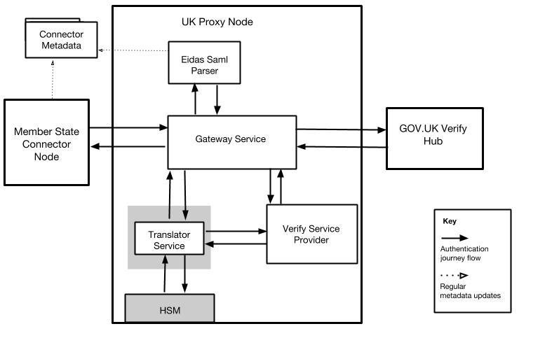

# GOV.UK Verify UK Proxy Node

## Technical overview

The UK Proxy Node allows GOV.UK Verify to provide identities as part of the eIDAS scheme. This document describes the architecture and behaviour of the UK Proxy Node.

### Role of the UK Proxy Node
As part of the eIDAS scheme, the UK must host a proxy node to allow users access to GOV.UK Verify when in an EU country. As defined in the eIDAS interoperability architecture, the proxy node will act as a front to one or more of a country’s identity schemes. 

The UK Proxy Node will be introduced into the architecture, as a REST-based microservice, to conform with eIDAS specifications. 

GOV.UK Verify uses a SAML message format that is different from the eIDAS specification. The UK Proxy Node supports the eIDAS SAML Profile and acts as an identity provider to EU member state services and as a Relying Party to GOV.UK Verify. 

The role of the UK Proxy Node is to:
 - convert eIDAS SAML to Verify SAML messages and vice versa
 - validate all the incoming requests and outgoing responses 
 - cryptographically sign all outgoing responses to EU services
 - encrypt the identity assertions sent to the EU services

To understand how the UK Proxy Node works within the eIDAS scheme, see the GOV.UK Verify message flow document submitted for peer review. 

## Components

The UK Proxy Node links the GOV.UK Verify Hub with EU member state connector nodes. EU member states that can consume identity information each host a connector node. The UK hosts the GOV.UK Verify Hub. For more information, see the GOV.UK Verify Hub Technical Overview document submitted for peer review.  

The Proxy Node contains the following services:
  - [Gateway](#gateway)
  - [Eidas-Saml-Parser](#eidas-saml-parser)
  - [Translator](#translator)
  - [Verify-Service-Provier](#verify-service-provider)

### Gateway

The Gateway service is an internet-facing component and is part of the UK Proxy Node. During a user journey, the Gateway service interacts with EU member state connector nodes and the GOV.UK Verify Hub.

For requests from a connector node, the Gateway service forwards the eIDAS SAML AuthnRequest to the Eidas Saml Parser (ESP) service to perform the SAML validation. The Gateway will then use the Verify Service Provider (VSP) to generate SAML AuthnRequests which are passed back to the Gateway service before the SAML AuthnRequest is sent to the Hub.  

For responses coming from the GOV.UK Verify Hub, the Gateway service forwards them to the Translator service. Responses from the Translator service are passed on to the EU member state connector node.

### Eidas-Saml-Parser

The Gateway Service sends the SAML AuthnRequest to the Eidas Saml Parser (ESP) service to validate the data and the signature of the request. 

The ESP is the only service which can consume the countries connector metadata. The ESP will extract the Public Encryption Certificate and Destination of the Country from the metadata and send it back to the Gateway along with the RequestID and Issuer which is extracted from the SAML AuthnRequest.

### Translator

Part of the UK Proxy Node, the Translator service receives the GOV.UK Verify Hub responses forwarded by the Gateway service. 

The Translator sends the SAML AuthnResponse to the Verify Service Provider (VSP) to perform the SAML validation. The Translator service will generate an eIDAS AuthnResponse based on the attributes it receives from the VSP. The Translator service then encrypts the assertion for the connector node and signs the eIDAS SAML response using the AWS CloudHSM. 

Once the eIDAS SAML response is signed, the Translator service passes it on to the Gateway service.

### Verify-Service-Provider

The Verify Service Provider (VSP) generates and translates Security Assertion Markup Language (SAML) messages to and from the GOV.UK Verify Hub. 
The Gateway service uses the VSP to generate SAML requests to send to the Verify Hub. For responses, the Translator service uses the VSP to validate SAML responses and translate them to JSON. 

## Connecting to Countries

We will host one instance of the proxy node services and infrastructure isolation per requesting Country connector node. All instances will share a single hardware security module (HSM) but will each have independent credentials to access the HSM, and an independent signing key held by the HSM.

## Infrastructure

The eIDAS Proxy Node is hosted on an Amazon AWS cloud infrastructure and runs on Kubernetes. This is isolated from all Verify Hub deployments to ensure that it is treated as a separate component. Public and private subnets are used to isolate the Translator service. Access to environments and deployments is controlled using AWS’s identity and access management permissions.

## Security operations monitoring

Security operations within the organisation will monitor transactions and access. Transaction monitoring will involve correlating messages entering with messages exiting the proxy node. Access monitoring will be put in place using Amazon's CloudWatch logging. Logs will be monitored by a Security Operations team to track access to servers, deployments and key rotations.

## UK Proxy Node key management

SAML responses going to EU member state connector nodes will be signed with keys stored on an HSM. These are keys with self-signed certificates. The same key will be used to sign the proxy node metadata. 

The Verify Service Provider will be responsible for signing AuthnRequests and decrypting Responses from the Verify Hub. The keys it uses to do this will be stored as sealed secrets.

|           Key type.          |        Key location        |
| ---------------------------- | -------------------------- |
| Metadata signing key         | AWS CloudHSM               |
| AuthnResponse signing key    | AWS CloudHSM               |
| AuthnRequest signing key     | Kubernetes sealed secrets  |
| AuthnResponse decryption key | Kubernetes sealed secrets  |

