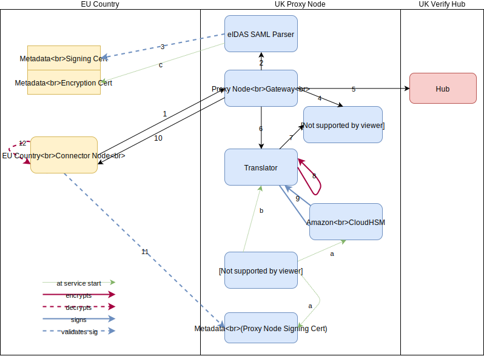

# UK Proxy Node PKI

The eIDAS Proxy Node Public Key Infrastructure (PKI) is detailed in the diagram and key below.
This PKI allows:

* encryption and decryption of the eIDAS SAML request and response
* signing and signature validation of the eIDAS SAML request and response
* publishing of PKI metadata between the UK Proxy Node and an EU connecting country

The diagram and key describe a sequential flow of of an eIDAS verify journey.

Key:

| Step      | Description |
| :----:       |    :---     |
| a   |`metadata-controller` provisions a non-extractable signing keypair in a `CloudHSM` and publishes the public key to `metadata`. It also signs the generated metadata using a keypair it generates itself.
| b   |`metadata-controller` distributes credentials to make use of the private signing key to the `translator`
| c   | `eidas-saml-parser` stores a copy of the EU country's public encryption certificate from the EU country's metadata
| 1   | The EU Country produces a signed eIDAS SAML Request, and sends to `gateway` via the browser
| 2   | `gateway` sends the signed eIDAS SAML Request to `eidas-saml-parser` for validation and parsing
| 3   | `eidas-saml-parser` validates the signature of the SAML request using the public signing certificate obtained from EU country metadata.
| 4   | `gateway` calls `verify-service-provider` to produce a signed SAML Request for Hub.
| 5   | `gateway` builds SAML Request for `Hub`, and posts to `Hub` via browser.
| 6   | `gateway` receives response from `Hub`, and sends to `translator` to process. The country public encryption certificate is sent in this request.
| 7   | `translator` calls `verify-service-provider` to provide user attributes.
| 8   | `translator` builds an eiDAS SAML Response, and encrypts the user attribute assertions for the EU country.
| 9   | `translator` signs the eiDAS SAML Response using the private key reference obtained in step b.
| 10   | `gateway` sends the eIDAS SAML response to the country via the browser.
| 11   | The EU Country decrypts the SAML response using its private encryption key.
| 12   | The EU Country validates the signature of the Proxy Node signed attributes using public signing key in Proxy Node metadata.

The PKI between `verify-service-provider` and `Hub` is [documented here](https://www.docs.verify.service.gov.uk/get-started/#get-started).